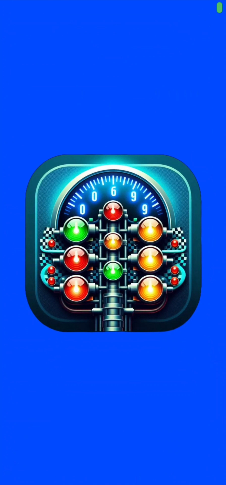
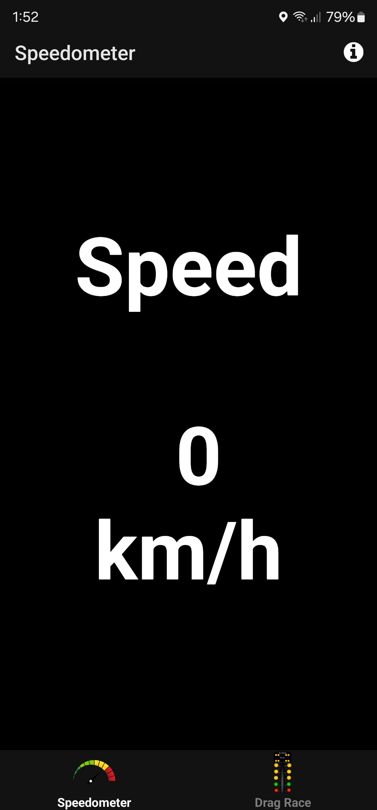
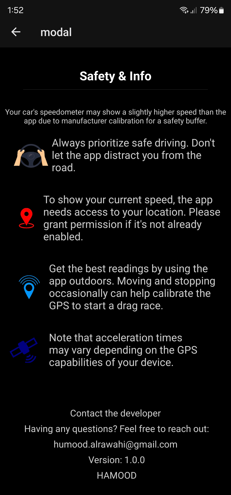
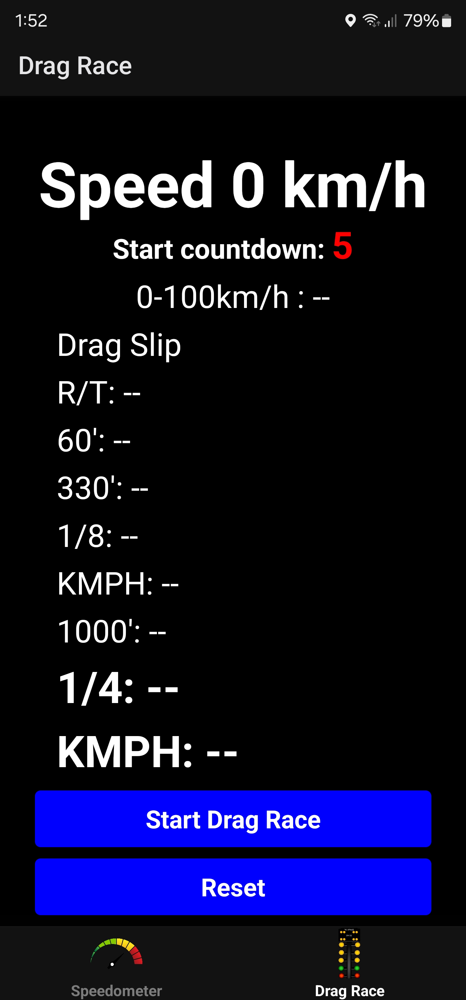
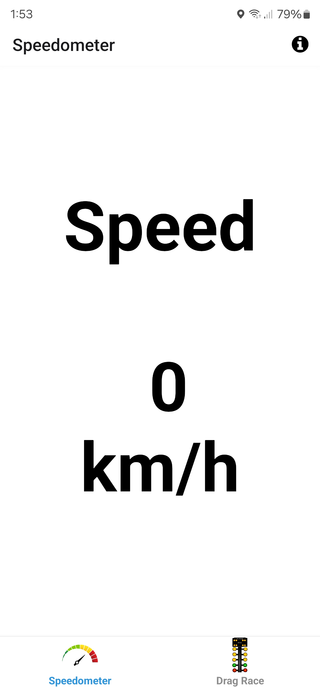
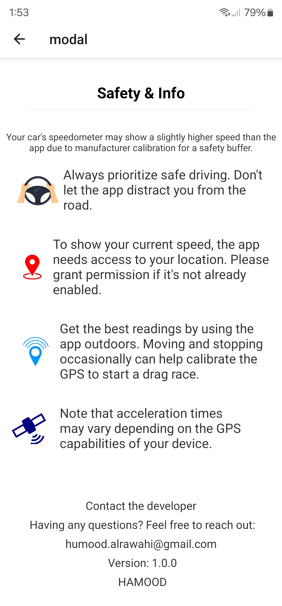
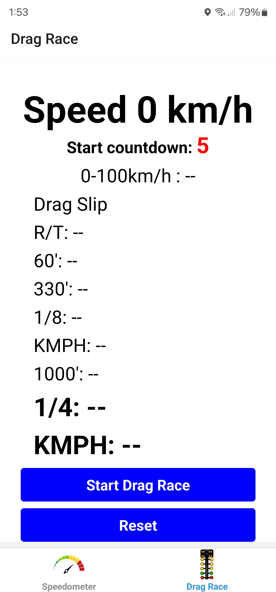

# SpeedoDragster
Welcome to SpeedoDragster! This is a React Native app for drag racing enthusiasts.

The App has been developed as React Native App using Expo. It is a Vehicle dashboard app that can provide instant actual GPS speed, acceleration times from 0-100kmph and Drag race measures R/T, 60ft, quarter mile etc..

## Installation
To install and run the app locally, follow these steps:
1. Clone the repository:
```sh
git clone https://github.com/HUMO0D/SpeedoDragster.git
```
2. Install dependencies:
```sh
npm install
```
Or
```sh
yarn install
```
Ensure you have the React Native CLI and necessary dependencies installed.

3. Start the development server:
```sh
npx expo start
```

## Download APK
You can just easly download the APK file from [here](https://drive.google.com/file/d/1XUhKurgp2_u-TEyeRvMOIp81DNBASqPM/view?usp=sharing).

## Demo and Test Runs
Watch a video demonstration of the app's functionality as well as two drag race test runs on two different cars where I compare the results I got on the app to results from an American automobile magazine called Motor Trend where results turned out to be relatively alike. Click the thumbnail below to watch it:

<div style="display: flex; justify-content: center;">
  <a href="https://drive.google.com/file/d/1ABOE4_CNqDOkQ24QK21zII9ONO6snBwV/view?usp=sharing">
    
  </a>
</div>

## Project idea
The app has two functionalities in two different tabs.
1. Tab 1 (Speedometer): Provides instant actual GPS speed of the vehicle.
2. Tab 2 (Drag race): it simulates a drag race which is launching the vehicle
from a standing start to certain speed or distance.

In the drag race tab, there is two types of measures:
* 0-100 km/h: 
* Drag slip

A drag race run includes:
1) Reaction time (R/T)
2) 60 Feet (60’)
3) 330 Feet (330’)
4) Eighth mile (1/8)
5) Eighth mile speed (KMPH)
6) 1000 Feet (1000’)
7) Quarter mile (1/4)
8) Quarter mile speed (KMPH)

## How the app works:
I used Expo Location library which “provides access to reading geolocation information, polling current location or subscribing location update events from the device” (Expo Documentation, https://docs.expo.dev/versions/latest/sdk/location/).

I also used Expo Audio which is “a library that provides an API to implement audio playback and recording in apps.” (Expo Documentation, https://docs.expo.dev/versions/latest/sdk/audio/) to play a countdown sound.

In the Speedometer I used Expo Location library to fetch the current speed, convert it from m/s to km/h and update it with intervals of 500 milliseconds.

Then in the drag race I used the same logic of getting the speed but with interval of 50 milliseconds to get more accurate results, here once the race starts (the speed goes above 0) it stores the current time using “Date.now()” and then subtract it with the time once the speed reach 100.

On the other hand, in the actual drag race (Drag Slip measures) which needs to measure the distance between two points, first it will store the current latitude and longitude once the start race button is pressed and then I used a formula that can determines the distance between two points on a sphere (The earth) given the latitude and longitude that is called haversine formula to measure the distance and then show the time and the speed once a certain distance reached. 

The app is Adaptive to the phone’s theme whether it is Dark or Light.

Screenshots from the App:

<div style="text-align: center;">
  <div style="display: inline-block;">
    
    
    
  </div>
</div>

<div style="text-align: center;">
  <div style="display: inline-block;">
    
    
    
  </div>
</div>


## User Requirements
**Software:**
- Android devices running Android 6.0 (Marshmallow) or newer.
- iOS devices running iOS 13.4 or newer.  (Still not released and haven't been tested)

**Hardware:**
- A phone with an integrated GPS receiver.


## Future Work
- Add more functionalities like roll race e.g. 80-120kmph, 100-200kmph
- Add Settings page, it can include :
    * User can chose App theme instead of being always automatic.
    * Unit conversion (KMPH to MPH) and vica versa.
    * Change the professionality of the drag race (Strat race countdown is random and invisible).
- Add a drag race tree (christmas tree) instead of a countdown.
- Use Expo Accelerometer library to use the device's accelerometer sensors for more accurate readings for the reaction time and calculate the G-force.
- Create a comprehensive dashboard for users to analyze their performance over time.
- Provide option for users to save their race data.
<br><br>
- Add a functionality where the app can connect to a dedicated external GPS receiver via Bluetooth, allowing it to fetch speed and other geolocation data from the external device for more accurate readings.

## Contributing
I welcome contributions from the community. If you'd like to contribute or suggest an idea to SpeedoDragster, please contact me through [Email](humood.alrawahi@gmail.com) or open an issue on GitHub.

## License
This project is licensed under the [MIT License](LICENSE).


[](https://expo.dev/)

